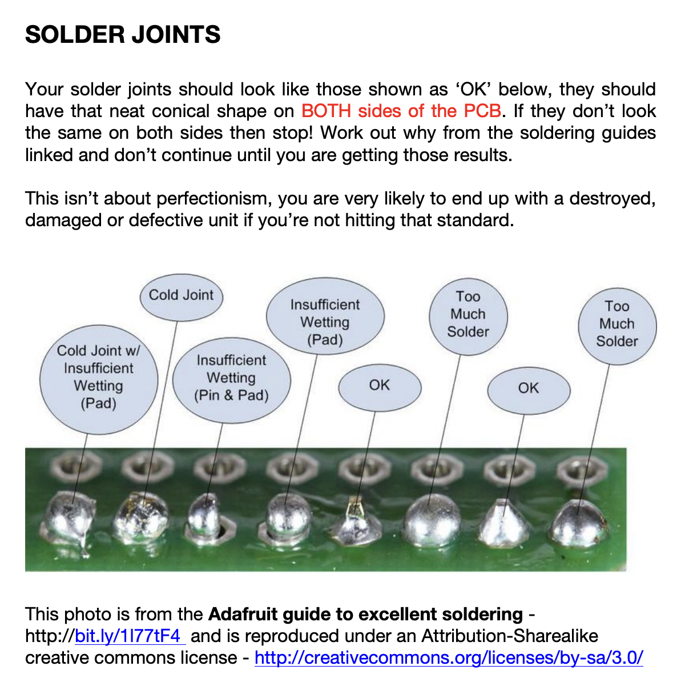

Soldering is like riding a bike. 

It's really hard until you've learnt how to do it. Then it's easy. 

If you find soldering frustrating or difficult, then something is wrong. It's not a struggle.  

It might be that you haven't learned the technique yet. 

It might be that your equipment isn't set up right — maybe the temperature is too low, or your tip isn't clean. 

It might be that you don't have enough light, or you need reading glasses or extra magnification. 

It might be that you're tired. 

These are my favourite resources for learning to solder: 

[1. This video from Curious Inventor explains it all in 7 minutes](https://www.youtube.com/watch?v=IpkkfK937mU).

[2. This video from Mylar Melodies is a 3-hour end-to-end guide to building a module](https://www.youtube.com/watch?v=HR_YfUlGPrI)

[3. And this 30-page PDF from Adafruit is the Instruction Manual for Soldering](https://cdn-learn.adafruit.com/downloads/pdf/adafruit-guide-excellent-soldering.pdf) 

 
 

 
