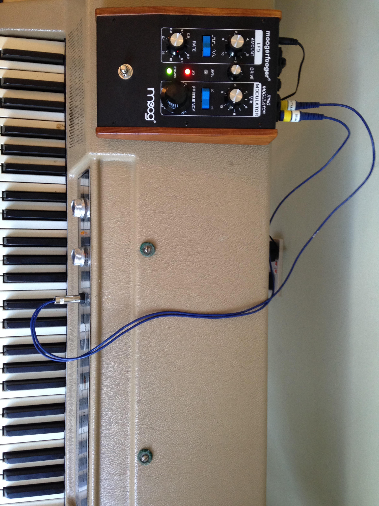
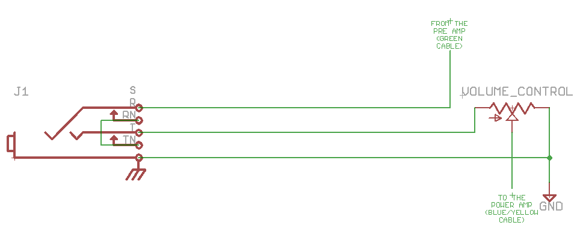
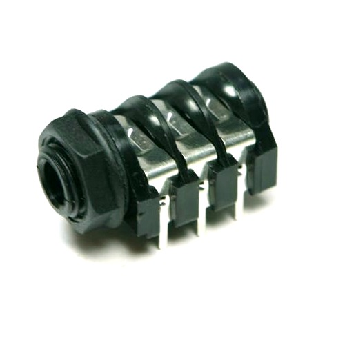
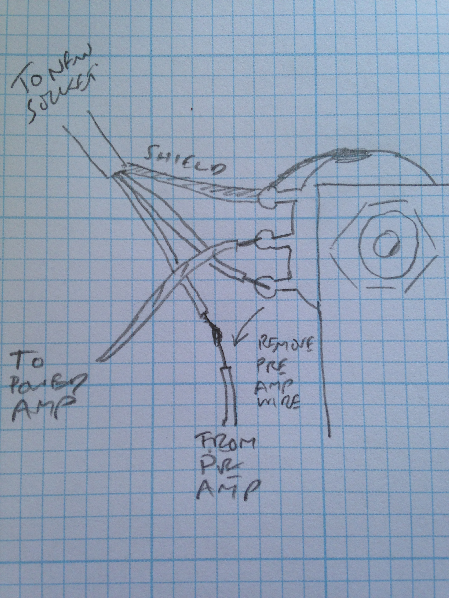

 

 
I’m lucky enough to have a beautiful Wurlitzer EP-200 Electric Piano. I like it because it’s self-contained, with a pair of speakers behind the panel and the lovely vibrato built-in. You just turn the volume control and it comes to life, and if I was to record it, I’d mic the speakers. I’ve barely ever used the headphone or line out sockets. That said, I do like effects, and wanted to try the piano with a Ditto Looper and a Moog MF-102 ring mod.

So, I wanted to add an effects loop, and it turned out to be surprisingly easy.

The theory of Effects Loops and Insert Points 

The Wurlitzer works much like a guitar amp. The reeds produce a very weak signal (like guitar pickups), which goes a pre amplifier (with tone controls on a guitar amp, and the vibrato on a Wurli). This signal is much stronger, similar to the line level signals you get from outboard effects units or a CD player. This signal then goes into a power amp strong enough to drive the speakers. On a guitar amp, you can either put effects at the start, between the guitar and the preamp (like normal stompboxes) or between the pre and the power amps, in an effects loop, which is what I wanted to create here (I didn’t want to mess about with the reed outputs).

My Wurli has a hole in the front panel, perhaps from an abandoned modification before it was restored by Klassic Keys in 2011, so I wanted to use that hole as an Insert Point – a single switched stereo jack socket carrying Send and Return down the same cable (which later splits into two mono jack plugs). You could do exactly the same thing with two sockets, one for send and one for return, but it would take up more space.

You normally use switched sockets, so that when the FX Loop isn’t connected, the piano works as normal.

A normal Insert Cable works like this: Tip = Send, Ring = Return, Sleeve = Ground. The switches in the socket are wired to connect Tip to Ring when no cable is inserted.

Where to put the Effects Loop on a Wurlitzer 200

Here’s the [Wurlitzer 200 Series Service Manual](http://manuals.fdiskc.com/flat/Wurlitzer%20Series%20200%20Service%20Manual.pdf) (pdf). The Schematic for the 200 is on Page 39. Right in the middle you can see that the volume control sits between the preamp (on the left) and the power amp (on the right). As the volume control is easy to find and access, that’s where I put the connections, so I didn’t need to mess about with the PCBs.

Here’s the schematic:

In practice it’s a very simple mod.

The hardest thing is working out where you’re going to put the socket – I was fortunate because my piano already has an ugly hole in the front panel.

I used this J-CL-104 stereo switched 1/4 inch socket because it’s cheap and easy to understand how the switches work.

Solder a bit of wire between the tip and ring switches, then connect a length of shielded 2-core wire (i.e. two conductors and shielding) to the three other pins (shield goes to the sleeve connector nearest the front).

Now the dramatic bit, soldering onto the Wurli.

The top tab on the volume pot is ground – you’ll see it connected to the case of the pot. Connect the shield wire to that tab.

The middle tab goes to the power amp, leave it.

The bottom tab has a wire from the pre-amp (it was green on my piano). Unsolder that wire and connect the wire to the cable wire connected to the TIP.

Then, connect the cable wire connected to the RING to the bottom tab on the pot.

That’s it.

Here’s a sketch:

